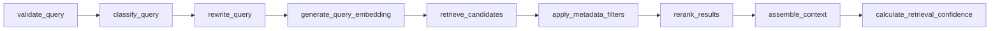

# Enterprise Knowledge Assistant

A production-oriented Retrieval-Augmented Generation (RAG) reference application for demos, technical interviews, architecture reviews, and learning. It demonstrates the lifecycle:

```text
Data Ingestion → Storage and Indexing → Retrieval → Generation → Response Delivery
```

The repository is intentionally organized as a cloud-portable monorepo. The local demo uses Docker Compose, while the package boundaries and infrastructure folders are designed to map later to AWS, Azure, or GCP.

> **Implementation status:** this repository contains a runnable local demo scaffold and core vertical slices for authentication, workspace authorization, ingestion, retrieval, generation, review routing, evaluation placeholders, and observability endpoints. It is **not yet a fully hardened production implementation of every requirement**. See [Implementation Coverage](#implementation-coverage) for the exact status and follow-up work.

---

## Table of Contents

1. [Architecture Summary](#architecture-summary)
2. [Repository Structure](#repository-structure)
3. [Technology Stack](#technology-stack)
4. [Local Quick Start](#local-quick-start)
5. [Default Credentials](#default-credentials)
6. [Configuration](#configuration)
7. [Docker Compose Service Map](#docker-compose-service-map)
8. [Domain Model](#domain-model)
9. [Core Interfaces and Boundaries](#core-interfaces-and-boundaries)
10. [Workflows](#workflows)
11. [API Contract](#api-contract)
12. [Demo Scenarios](#demo-scenarios)
13. [Evaluation](#evaluation)
14. [Observability](#observability)
15. [Security Model](#security-model)
16. [Testing](#testing)
17. [Development Commands](#development-commands)
18. [Implementation Coverage](#implementation-coverage)
19. [Production Hardening Roadmap](#production-hardening-roadmap)
20. [Troubleshooting](#troubleshooting)
21. [Architecture Decisions](#architecture-decisions)

---

## Architecture Summary

The application is split into independent layers with explicit boundaries:

| Layer | Responsibility | Local implementation |
| --- | --- | --- |
| UI | Enterprise pages for chat, documents, knowledge bases, evaluation, reviews, observability, and administration | dependency-light Node/HTML shell in `apps/web` (Next.js-ready directory retained) |
| API | Versioned REST/SSE endpoints, JWT auth, RBAC, workspace authorization, OpenAPI, metrics | FastAPI in `apps/api` |
| Worker | Async ingestion process boundary | Worker process in `apps/worker` |
| Ingestion | Source registration, text normalization, chunk creation, metadata persistence, job status tracking | `packages/ingestion` |
| Retrieval | Workspace-scoped similarity, hybrid, and MMR-style retrieval diagnostics | `packages/retrieval` |
| Generation | Structured answers, citations, confidence, review routing, safe fallback | `packages/generation` |
| Guardrails | Prompt-injection detection and PII redaction primitives | `packages/guardrails` |
| Providers | Embedding/LLM provider abstraction points | `packages/providers` |
| Shared | Typed settings and SQLModel entities | `packages/shared` |
| Infrastructure | Local Compose, Dockerfiles, Prometheus, Grafana, cloud-ready folders | `infrastructure` |

The current local runtime defaults to deterministic mock-style providers so the application can be demonstrated without paid model credentials. Provider seams are deliberately isolated so OpenAI, Azure OpenAI, Ollama, Anthropic, managed vector stores, and cloud object stores can be introduced without rewriting domain logic.

---

## Repository Structure

```text
.
├── apps/
│   ├── api/                    # FastAPI composition root, routers, DB bootstrap, Alembic
│   ├── web/                    # Next.js enterprise UI shell
│   └── worker/                 # Background worker entrypoint
├── packages/
│   ├── ingestion/              # Document ingestion domain service
│   ├── retrieval/              # Retrieval scoring and diagnostics
│   ├── generation/             # Answer generation and citation formatting
│   ├── evaluation/             # Evaluation extension package
│   ├── guardrails/             # Prompt injection and PII checks
│   ├── observability/          # Observability extension package
│   ├── providers/              # Embedding/LLM provider abstraction points
│   └── shared/                 # Configuration and SQLModel schema
├── infrastructure/
│   ├── docker/                 # API, worker, and web Dockerfiles
│   ├── kubernetes/             # Cloud deployment placeholder
│   ├── terraform/              # IaC placeholder
│   ├── prometheus/             # Prometheus scrape config
│   └── grafana/                # Dashboard placeholder
├── sample-data/                # Demo enterprise documents
├── evaluation-data/            # Demo evaluation questions
├── scripts/                    # Seed and evaluation scripts
├── tests/                      # Backend unit tests
├── docs/                       # Architecture, API, security, retrieval, evaluation, demo docs
├── docker-compose.yml
├── Makefile
├── .env.example
└── pyproject.toml
```

---

## Technology Stack

### Backend

- Python 3.11+
- FastAPI
- SQLModel / SQLAlchemy-style ORM operations
- Alembic migration scaffold
- Pydantic settings validation
- JWT authentication with role-based workspace authorization
- Prometheus metrics endpoint

### Frontend

- Dependency-light Node.js web shell for PR-check reliability
- TypeScript/Next.js-ready directory structure retained
- Enterprise dashboard shell with professional page cards
- Intended upgrade path: Next.js, Tailwind CSS, shadcn/ui, TanStack Query, Playwright

### Storage and Infrastructure

- PostgreSQL for relational metadata
- Redis for cache/queue/rate-limit concerns
- Qdrant for vector storage
- MinIO for S3-compatible object storage
- Prometheus and Grafana for metrics dashboards
- Optional Ollama profile for local model demos

---

## Local Quick Start

### Prerequisites

- Docker and Docker Compose
- Make
- Python 3.11+ if running tests/scripts outside containers
- Node 20+ if running the web app outside containers

### Start the full local stack

```bash
cp .env.example .env
docker compose up --build
```

### Open services

| Service | URL |
| --- | --- |
| Web app | http://localhost:3000 |
| FastAPI Swagger UI | http://localhost:8000/docs |
| FastAPI OpenAPI JSON | http://localhost:8000/openapi.json |
| API health | http://localhost:8000/health/live |
| Prometheus | http://localhost:9090 |
| Grafana | http://localhost:3001 |
| MinIO console | http://localhost:9001 |
| Qdrant | http://localhost:6333/dashboard |

### Seed demo data

After the API container is available, run:

```bash
make seed
```

The seed script creates a demo workspace and ingests the markdown files under `sample-data/`.

---

## Default Credentials

The API startup hook creates a default user when no matching user exists:

```text
Email:    admin@example.com
Password: admin
```

Use the login endpoint to obtain a bearer token:

```bash
curl -s http://localhost:8000/api/v1/auth/login \
  -H 'Content-Type: application/json' \
  -d '{"email":"admin@example.com","password":"admin"}'
```

---

## Configuration

Copy `.env.example` to `.env` before starting the stack.

Important configuration groups:

| Group | Variables |
| --- | --- |
| Database | `DATABASE_URL` |
| Redis | `REDIS_URL` |
| Qdrant | `QDRANT_URL` |
| MinIO | `MINIO_ENDPOINT`, `MINIO_ACCESS_KEY`, `MINIO_SECRET_KEY`, `MINIO_BUCKET` |
| LLM | `LLM_PROVIDER`, `LLM_MODEL` |
| Embeddings | `EMBEDDING_PROVIDER`, `EMBEDDING_MODEL`, `EMBEDDING_VERSION` |
| JWT | `JWT_SECRET`, `JWT_ISSUER`, `JWT_EXPIRE_MINUTES` |
| Retrieval | `RETRIEVAL_TOP_K`, `RETRIEVAL_FETCH_K`, `RETRIEVAL_SIMILARITY_THRESHOLD`, `RETRIEVAL_MMR_LAMBDA` |
| Safety | `HUMAN_REVIEW_THRESHOLD`, `UPLOAD_MAX_BYTES` |
| Observability | `OTEL_EXPORTER_OTLP_ENDPOINT`, `LANGSMITH_ENABLED`, `LOG_LEVEL` |
| Web/API boundary | `CORS_ORIGINS` |

---

## Docker Compose Service Map

| Service | Port(s) | Purpose |
| --- | --- | --- |
| `web` | `3000` | Dependency-light enterprise web shell |
| `api` | `8000` | FastAPI REST/SSE API source image; CI Dockerfile omits dependency install for offline checks |
| `worker` | none | Background ingestion process boundary |
| `postgres` | `5432` | Relational metadata |
| `redis` | `6379` | Queue/cache/rate-limit backing service |
| `qdrant` | `6333` | Vector database |
| `minio` | `9000`, `9001` | S3-compatible object storage and console |
| `prometheus` | `9090` | Metrics collection |
| `grafana` | `3001` | Metrics dashboards |
| `ollama` | `11434` | Optional local model runtime via Compose profile |

Start optional Ollama:

```bash
docker compose --profile ollama up --build
```

---

## Domain Model

The SQLModel schema contains the required enterprise RAG entities:

- `User`
- `Role`
- `Workspace`
- `WorkspaceMembership`
- `Document`
- `DocumentVersion`
- `DocumentChunk`
- `IngestionJob`
- `EmbeddingConfiguration`
- `RetrievalConfiguration`
- `Conversation`
- `Message`
- `RetrievalTrace`
- `GeneratedResponse`
- `Citation`
- `UserFeedback`
- `EvaluationDataset`
- `EvaluationQuestion`
- `EvaluationRun`
- `EvaluationResult`
- `HumanReview`
- `AuditLog`

All primary domain entities use UUID primary keys. Timestamped models include `created_at` and `updated_at`. Workspace-scoped entities include `workspace_id` where relevant. Documents and workspaces support soft deletion through `deleted_at`.

---

## Core Interfaces and Boundaries

The codebase is organized around the following domain seams:

| Interface / seam | Purpose | Current implementation |
| --- | --- | --- |
| `EmbeddingProvider` | Generate embeddings without coupling retrieval to a model vendor | Deterministic hash embedding provider |
| `LLMProvider` | Planned seam for OpenAI/Azure/Ollama/Anthropic generation | Generation service currently uses deterministic grounded response logic |
| `MetadataStore` | Persist relational state | SQLModel sessions |
| `VectorStore` | Store and search vectors | Planned Qdrant adapter; current demo searches persisted chunks directly |
| `ObjectStore` | Store original files/artifacts | Planned MinIO/S3 adapter; current upload text is persisted through metadata path |
| `TaskQueue` | Enqueue and retry background work | Worker process boundary exists; current ingestion is synchronous for demo reliability |
| `Reranker` | Rerank retrieval candidates | Planned local/LLM reranker; current hybrid score combines lexical and vector signals |

These seams make the scaffold useful for architecture reviews while keeping the local demo easy to run.

---

## Workflows

### Ingestion workflow


Current demo status: document registration, status transitions, chunking, metadata persistence, embedding metadata, completion/failure, and dead-letter flags are implemented. Object storage, extraction libraries, language detection, and Qdrant indexing are extension points.

### Retrieval workflow



Current demo status: query embedding, workspace-scoped candidate retrieval, metadata filtering, similarity/hybrid/MMR-style scoring, and diagnostics are implemented. Full LangGraph node wiring, advanced query rewriting, BM25 index, parent-child retrieval, and reranker adapters are roadmap items.

### Generation workflow

```mermaid
flowchart LR
  A[build_prompt] --> B[apply_input_guardrails]
  B --> C[generate_answer]
  C --> D[validate_structured_output]
  D --> E[verify_citations]
  E --> F[calculate_answer_confidence]
  F --> G[detect_unsupported_claims]
  G --> H[human_review_decision]
  H --> I[format_response]
```



Current demo status: guardrails, safe fallback, structured answer shape, citation creation, confidence scoring, and review routing are implemented. Full LLM prompt rendering, output repair retries, token accounting, and citation verification against an external model are roadmap items.

---

## API Contract

FastAPI exposes OpenAPI at `/openapi.json` and Swagger UI at `/docs`.

### Authentication

| Method | Path | Purpose |
| --- | --- | --- |
| `POST` | `/api/v1/auth/login` | Return JWT access token |
| `GET` | `/api/v1/auth/me` | Return current authenticated user |

### Workspaces

| Method | Path | Purpose |
| --- | --- | --- |
| `POST` | `/api/v1/workspaces` | Create workspace |
| `GET` | `/api/v1/workspaces` | List authorized workspaces |
| `GET` | `/api/v1/workspaces/{workspace_id}` | Get workspace |
| `PATCH` | `/api/v1/workspaces/{workspace_id}` | Update workspace |

### Documents

| Method | Path | Purpose |
| --- | --- | --- |
| `POST` | `/api/v1/workspaces/{workspace_id}/documents` | Upload document |
| `POST` | `/api/v1/workspaces/{workspace_id}/sources/url` | Register URL source |
| `GET` | `/api/v1/workspaces/{workspace_id}/documents` | List workspace documents |
| `GET` | `/api/v1/documents/{document_id}` | Get document metadata |
| `DELETE` | `/api/v1/documents/{document_id}` | Soft-delete document |
| `POST` | `/api/v1/documents/{document_id}/retry` | Queue retry placeholder |
| `POST` | `/api/v1/documents/{document_id}/reindex` | Queue reindex placeholder |
| `GET` | `/api/v1/documents/{document_id}/chunks` | Inspect generated chunks |

### Chat and Retrieval

| Method | Path | Purpose |
| --- | --- | --- |
| `POST` | `/api/v1/chat/query` | Non-streaming grounded answer |
| `POST` | `/api/v1/chat/stream` | SSE streaming answer |
| `POST` | `/api/v1/retrieval/search` | Retrieval debugging search |
| `POST` | `/api/v1/retrieval/compare` | Compare similarity, MMR, and hybrid |
| `GET` | `/api/v1/retrieval/{request_id}/trace` | Retrieval trace placeholder |

### Conversations, Evaluations, Reviews, Feedback, Health

| Method | Path | Purpose |
| --- | --- | --- |
| `GET` | `/api/v1/conversations` | List conversations placeholder |
| `GET` | `/api/v1/conversations/{conversation_id}` | Get conversation placeholder |
| `DELETE` | `/api/v1/conversations/{conversation_id}` | Delete conversation placeholder |
| `POST` | `/api/v1/evaluations/datasets` | Create dataset placeholder |
| `POST` | `/api/v1/evaluations/runs` | Execute evaluation placeholder |
| `GET` | `/api/v1/evaluations/runs/{run_id}` | Get evaluation run placeholder |
| `GET` | `/api/v1/evaluations/runs/{run_id}/results` | Get evaluation results placeholder |
| `GET` | `/api/v1/reviews` | List review queue |
| `GET` | `/api/v1/reviews/{review_id}` | Get review details |
| `POST` | `/api/v1/reviews/{review_id}/approve` | Approve response |
| `POST` | `/api/v1/reviews/{review_id}/reject` | Reject response |
| `POST` | `/api/v1/responses/{response_id}/feedback` | Submit user feedback |
| `GET` | `/health/live` | Liveness probe |
| `GET` | `/health/ready` | Readiness probe |
| `GET` | `/health/dependencies` | Dependency status summary |
| `GET` | `/metrics` | Prometheus metrics |

### Example API flow

```bash
TOKEN=$(curl -s http://localhost:8000/api/v1/auth/login \
  -H 'Content-Type: application/json' \
  -d '{"email":"admin@example.com","password":"admin"}' | python -c 'import json,sys; print(json.load(sys.stdin)["access_token"])')

WORKSPACE_ID=$(curl -s http://localhost:8000/api/v1/workspaces \
  -H "Authorization: Bearer $TOKEN" \
  -H 'Content-Type: application/json' \
  -d '{"name":"HR Knowledge Base","description":"Demo workspace"}' | python -c 'import json,sys; print(json.load(sys.stdin)["id"])')

curl -s http://localhost:8000/api/v1/workspaces/$WORKSPACE_ID/documents \
  -H "Authorization: Bearer $TOKEN" \
  -H 'Idempotency-Key: leave-policy-v1' \
  -F 'file=@sample-data/employee-leave-policy.md'

curl -s http://localhost:8000/api/v1/chat/query \
  -H "Authorization: Bearer $TOKEN" \
  -H 'Content-Type: application/json' \
  -d "{\"workspace_id\":\"$WORKSPACE_ID\",\"question\":\"How many annual leave days do employees receive?\",\"strategy\":\"hybrid\",\"top_k\":3}"
```

---

## Demo Scenarios

The sample data supports the requested demo scenarios:

| Scenario | Demo question/action | Expected behavior |
| --- | --- | --- |
| Successful grounded answer | “How many annual leave days do employees receive?” | Returns answer with leave-policy citation |
| Multi-document answer | Ask about leave and travel reimbursement | Retrieves relevant policy chunks |
| Retrieval comparison | Use `/api/v1/retrieval/compare` | Shows similarity, MMR, and hybrid results |
| Hallucination prevention | Ask for unavailable cafeteria menu | Returns safe “I do not know” behavior when no safe context is selected |
| Prompt injection | Query security policy containing malicious text | Guardrails ignore instruction-like retrieved content |
| Access control | Query another workspace’s document ID | Workspace membership check denies access |
| Human review | Ask a low-confidence or unsafe question | Response is inserted into review queue |
| Evaluation | Run `make evaluate` | Prints demo metrics from evaluation dataset |

---

## Evaluation

The demo dataset lives in `evaluation-data/demo_questions.json` and includes:

- Direct factual retrieval
- No-answer behavior
- Prompt-injection behavior

Run:

```bash
make evaluate
```

The current script reports deterministic placeholder metrics for architecture demonstration. Production-ready evaluation should execute the actual retrieval/generation pipeline and persist `EvaluationRun` and `EvaluationResult` records.

---

## Observability

Implemented surfaces:

- `/health/live`
- `/health/ready`
- `/health/dependencies`
- `/metrics`
- `RetrievalTrace` persistence for chat requests
- Prometheus scrape configuration
- Grafana service placeholder

Production observability roadmap:

- Request-scoped structured JSON logs with `request_id`, `trace_id`, `user_id`, `workspace_id`, and `conversation_id`
- OpenTelemetry spans for query understanding, embedding, vector search, reranking, context assembly, LLM generation, guardrails, citation verification, and total latency
- Token usage and estimated cost tracking per provider
- Cache hit/miss metrics
- Failure and retry metrics for ingestion workers
- LangSmith integration behind `LANGSMITH_ENABLED`

---

## Security Model

Implemented security controls:

- JWT login and current-user endpoint
- Password hashing
- Role enum: `admin`, `knowledge_manager`, `reviewer`, `user`
- Workspace membership table
- Server-side workspace authorization helper
- Workspace-scoped document/chunk retrieval
- Soft deletion for documents/workspaces
- Prompt-injection detection primitives
- PII redaction primitives
- CORS configuration via environment variables

Production security roadmap:

- Rotate `JWT_SECRET` through a managed secret store
- Replace default demo credentials before deployment
- Add rate-limiting middleware backed by Redis
- Add upload size enforcement and MIME/content validation middleware
- Add malware scanning adapter before ingestion
- Store full audit logs for privileged actions
- Add row-level security or database policies for defense in depth
- Add document-level ACL payload filters in Qdrant
- Add secure error response middleware

---

## Testing

Backend tests currently cover:

- Ingest → retrieve → generate grounded flow
- Prompt-injection content not used as a grounded answer

Run:

```bash
make test
```

Or directly:

```bash
pytest -q
```

If dependencies are unavailable locally, install them first in a normal network-enabled development environment:

```bash
pip install -e .
```

CI is configured to compile Python files, run tests, build the frontend, build the backend image, and expose hooks for security, secret, and container vulnerability scans.

---

## Development Commands

| Command | Purpose |
| --- | --- |
| `make setup` | Create `.env` from `.env.example` if absent |
| `make up` | Start local Docker Compose stack |
| `make down` | Stop local stack |
| `make migrate` | Run Alembic migrations |
| `make seed` | Seed demo data |
| `make test` | Run backend tests |
| `make lint` | Byte-compile Python packages as a lightweight lint check |
| `make format` | Placeholder formatting command |
| `make evaluate` | Run demo evaluation script |
| `make reset` | Stop stack and remove volumes |
| `make logs` | Follow Compose logs |

---

## Implementation Coverage

| Requirement area | Status | Notes |
| --- | --- | --- |
| Monorepo layout | Implemented | Apps, packages, infrastructure, docs, sample data, tests |
| Docker Compose stack | Partial | Compose map exists; CI Dockerfiles are dependency-light for restricted checks and should be productionized with locked dependency installation |
| Authentication | Implemented | JWT login and `/me` |
| RBAC/workspaces | Implemented | Workspace memberships and role checks |
| Database entities | Implemented | Required SQLModel entities exist |
| File upload | Demo implemented | UTF-8 text-oriented upload path |
| URL ingestion | Demo implemented | Accepts URL and optional supplied text |
| Async ingestion | Partial | Worker boundary exists; ingestion currently runs synchronously in API path |
| Extraction for PDF/DOCX/HTML | Partial | Extension point exists; dedicated parsers not yet implemented |
| Chunking strategies | Partial | Fixed character chunking implemented; strategy interfaces are documented roadmap |
| Embeddings | Demo implemented | Deterministic hash embeddings; provider seam exists |
| Qdrant vector store | Partial | Service is in Compose; adapter not wired yet |
| MinIO object store | Partial | Service is in Compose; adapter not wired yet |
| Redis cache/queue | Partial | Service is in Compose; cache/queue adapter not wired yet |
| Retrieval strategies | Demo implemented | Similarity, hybrid, and MMR-style scoring over persisted chunks |
| LangGraph workflows | Partial | Workflows documented; code is service-based pending graph wiring |
| Generation | Demo implemented | Structured deterministic grounded answers with citations |
| Streaming | Implemented | SSE endpoint streams answer tokens |
| Citation validation | Partial | Citations are attached to selected chunks; rigorous quote validation pending |
| Guardrails | Demo implemented | Prompt-injection and PII primitives |
| Human review | Demo implemented | Low-confidence responses create review queue entries |
| Evaluation | Partial | Demo dataset and placeholder metrics script/endpoints |
| Observability | Partial | Health and Prometheus endpoint; full OTel tracing pending |
| Frontend | Partial | Dependency-light professional shell; Next.js/Tailwind interactive workflows pending |
| CI/CD | Partial | CI skeleton; full scans use placeholders |
| Documentation | Implemented | README plus focused docs under `docs/` |

---

## Production Hardening Roadmap

Before using this as a real enterprise system, complete these work items:

1. Replace synchronous ingestion with a durable Redis/Celery/Dramatiq/Arq queue and worker retries.
2. Add production extractors for PDF, DOCX, HTML, CSV, JSON, and remote websites.
3. Implement Qdrant adapter with collection aliases, vector versioning, payload filters, and delete-by-document.
4. Implement MinIO/S3 object-store adapter with encryption-ready metadata and lifecycle deletion.
5. Implement Redis cache keys including workspace, query hash, retrieval config version, embedding version, index version, prompt version, and model.
6. Wire retrieval and generation workflows with LangGraph nodes and trace each node with OpenTelemetry.
7. Add OpenAI, Azure OpenAI, Ollama, and optional Anthropic provider adapters.
8. Add reranker interface implementations for local cross-encoder and LLM reranking.
9. Add robust citation verification and unsupported-claim detection.
10. Add file-type validation, size enforcement, malware-scanning adapter, and secure error responses.
11. Expand frontend pages from shell cards into fully interactive screens.
12. Persist online evaluation signals and implement full offline metric computation.
13. Replace dependency-light CI Dockerfiles with production runtime images that install locked backend dependencies.
14. Add contract tests for repository interfaces and integration tests with Postgres, Redis, Qdrant, and MinIO.
15. Add production-grade CI security scans, container vulnerability scans, and secret scanning.
16. Add Kubernetes manifests, Helm/Kustomize overlays, and cloud deployment documentation.

---

## Troubleshooting

### API container cannot connect to PostgreSQL

Check container health:

```bash
docker compose ps postgres
```

Then inspect logs:

```bash
docker compose logs postgres api
```

### Login fails

The default user is created during FastAPI startup. Ensure the API started successfully and use:

```text
admin@example.com / admin
```

### Tests fail with missing dependencies

Install the project dependencies in a network-enabled environment:

```bash
pip install -e .
pytest -q
```

### Docker is unavailable

Run the app in a host Python/Node environment or use a machine with Docker Desktop / Docker Engine installed.

---

## Architecture Decisions

Major choices are documented under `docs/adr/`.

Current ADRs:

- `docs/adr/0001-architecture.md` — clean architecture and provider interfaces

---

## License

This scaffold is provided for demonstration and learning purposes. Add the appropriate enterprise/project license before redistribution.
